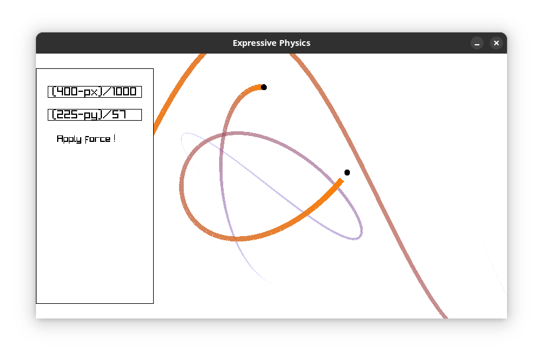
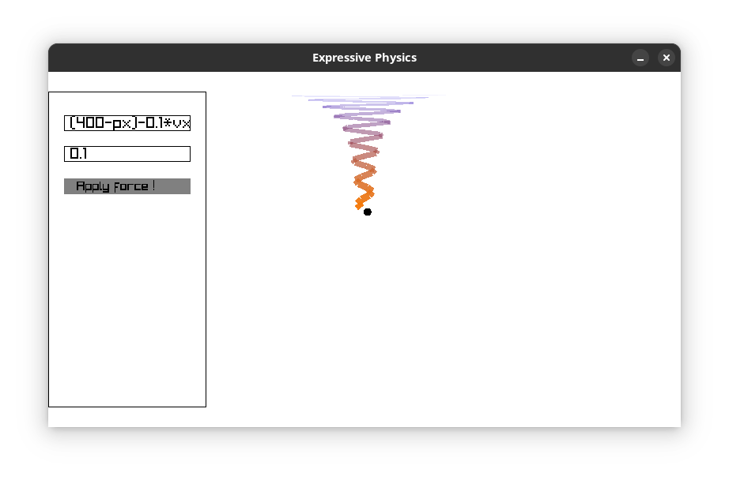
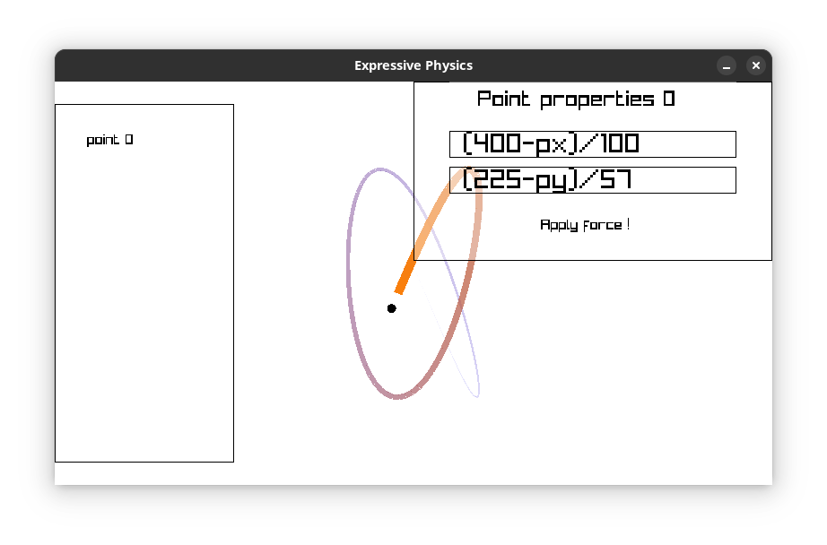
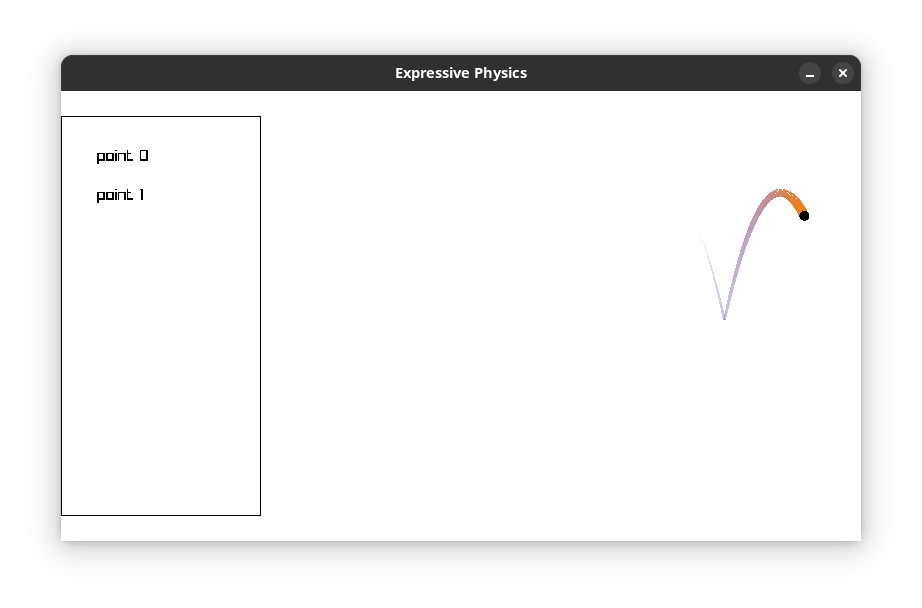

# What ?

Expressive Physics aims to be a fun physics simulation tool allowing users to input forces expressions to apply on multiple points.

# When ?

This project is in pre-pre-pre-alpha state, everything will be eventualy refactored and cleaned up. Until then, the documentation can
help up clarifying what is what and how to use it. Just run :
```
cargo doc --open
```
In the project root.

# How ?

To run the app, clone (or download) the repository and run
```
cargo run --release
```
Compilation may fail due to unsatisfied dependencies of the [raylib-rs](https://docs.rs/crate/raylib/latest) crate. If so, please refer to
its documentation.

## What can you currently do in-app

* Add multiple points (Right click > Add point)
* Set the x and y force of the last point (Type in input fields > press "Apply Force !")
	* Force expression examples :
		1. Gravity :
			* x = 0
			* y = 1
		1. Smooth left-right :
			* x = (400 - px)/100
			* y = 0
		1. Ground collision :
			* x = 0
			* y = (py>400) * (-2 * vy)

# Screenshots






# What to do ?

* UI
	1. Stop input fields from overflowing when the user types a long string
	1. Show errors on window rather than in console
	1. Stop scroll menu from overflowing
	1. Add options in contextual menu (right click in-app)
* Expressivity
	1. Make expressions accept trigonometrics functions, absolute, exponentials, sqrt, powers etc...
* Code quality
	1. Document and clean up every last bit of code !

When all of this will be completed, the app should be usable !